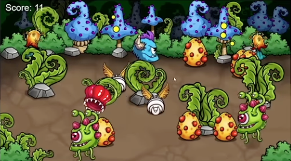

# Protect the Larva

A simple but fun 2D game! Try and see if you can protect the Larva the Eggs hatched!
Languages: Javascript, CSS, and HTML
 

## Description

This Project is coded along with @Frankslaboratory tutorial video.
Some adjustment was made for improved performance and clarity of the game.
 

## Demo

 

## How to Run

You can access this Project by clicking on this <a href="https://hujianni.github.io/Protect-the-Larva/" target="_blank">link</a>.
When the page is loaded, the game starts. Click within the frame to move your charater around. Push the eggs or the hatched larvas towards the bushes above and they're be safe (and you score 1 point)!
You can also push the unhatched eggs to the bushes before they are hatched to win the point.
Push away the enemies (those green toads) to protect the larva - or else you'll lost one, and if you lose 5 in total, you lost!

Score 10 to win, and press 'R' to restart the game whenever you want.

 

## Future improvements

- [ ] Create explanation for the game before starting
- [ ] Allow gamer to start the game by pressing down keys
- [ ] Make the playing area responsive to different device type (instead of fixed width and height)
- [ ] Add more diversity to the enemies
- [ ] Optimize the scoring structure
